

  

<h1 align="center">mmDotCleaner</h1>

  Fegt <code>.DS_Store</code>- und <code>._</code>-Dateien aus jedem Ordner – mit einem Klick in der Symbolleiste des Finders. 
  <a href="../../releases/latest"><b>Download</b></a> · <a href="#english">English</a>

<picture>
  <source media="(prefers-color-scheme: dark)" srcset="images/de/hero-dark.png">
  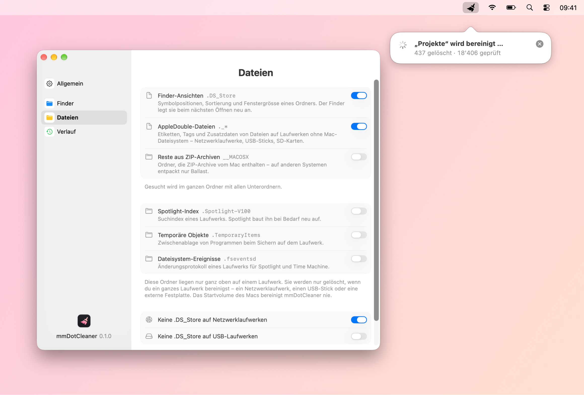
</picture>

## Funktionen

- **Ein Klick im Finder:** Der Besen in der Symbolleiste bereinigt den Ordner, der im Fenster offen ist – samt allen Unterordnern, auch ganze Netzwerklaufwerke, USB-Sticks und externe Festplatten. Ohne Rückfrage, ohne Menü.
- **Schattendateien von macOS:** `.DS_Store` (Ansichten des Finders) und `._*` (AppleDouble-Dateien) – dazu auf Wunsch `__MACOSX` aus ZIP-Archiven sowie `.Spotlight-V100`, `.TemporaryItems` und `.fseventsd` ganz oben auf einem Laufwerk. Welche Arten gelöscht werden, stellst du selbst ein. Alles andere bleibt unangetastet, der Papierkorb eines Laufwerks und das Startvolume des Macs ebenfalls.
- **Fortschritt in der Menüleiste:** Eine Blase unter dem Symbol zeigt, was gerade bereinigt wird, und danach das Ergebnis. Sie schliesst sich nach ein paar Sekunden von selbst.
- **Rechtsklick-Menü:** „Schattendateien bereinigen“ für markierte Ordner oder den Fensterhintergrund; mehrere Ordner werden nacheinander bereinigt.
- **Vorbeugen:** Auf Wunsch legt der Finder auf Netzwerk- und USB-Laufwerken gar keine neuen `.DS_Store`-Dateien mehr an.
- **Verlauf und Fehlerprotokoll:** Jede Bereinigung mit Ordner, Anzahl je Dateiart und Dauer; Dateien, die sich nicht löschen liessen, stehen im Fehlerprotokoll.
- **Menüleisten-App:** Symbol wählbar und ausblendbar, Start bei der Anmeldung, Erscheinungsbild Automatisch/Hell/Dunkel, automatische Updates nach Bestätigung, **Deutsch, Englisch, Französisch, Italienisch und Spanisch**, Liquid Glass ab macOS 26.

  <picture>
    <source media="(prefers-color-scheme: dark)" srcset="images/de/progress-dark.png">
    
  </picture>
  <picture>
    <source media="(prefers-color-scheme: dark)" srcset="images/de/result-dark.png">
    
  </picture>

<picture>
  <source media="(prefers-color-scheme: dark)" srcset="images/de/menubar-dark.png">
  
</picture>

## Einstellungen

  <picture>
    <source media="(prefers-color-scheme: dark)" srcset="images/de/settings-general-dark.png">
    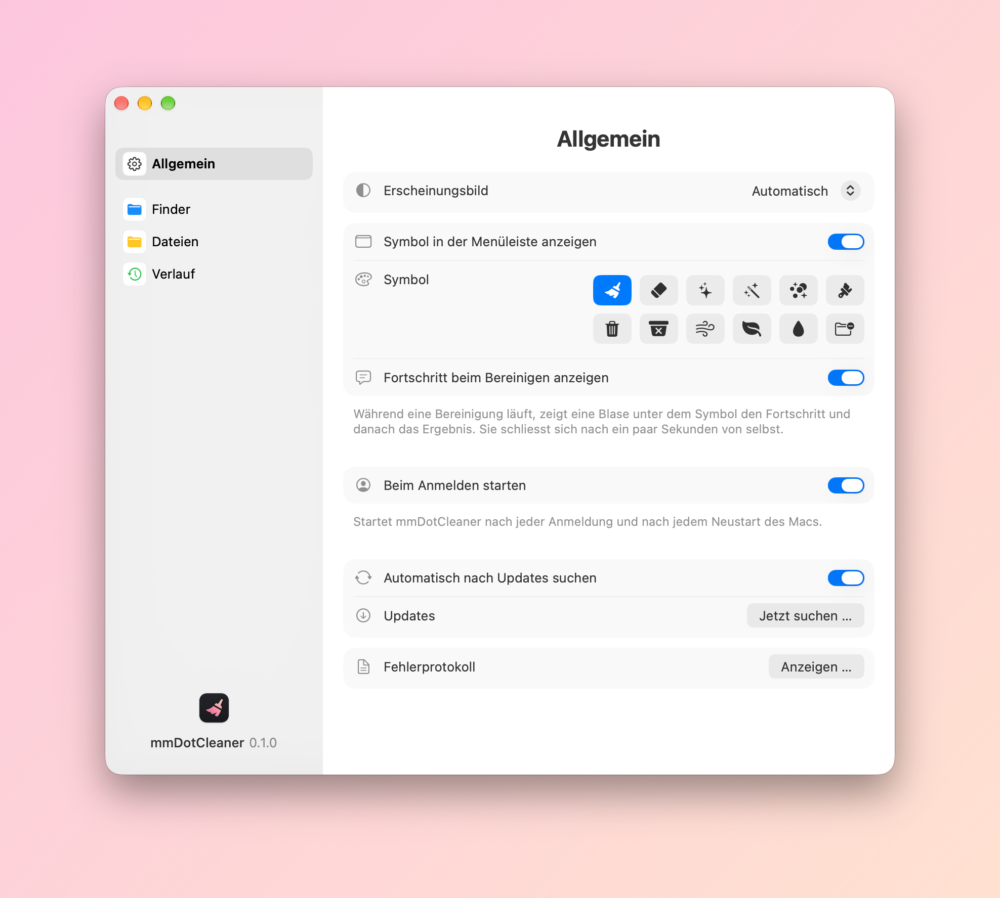
  </picture>
  <picture>
    <source media="(prefers-color-scheme: dark)" srcset="images/de/settings-finder-dark.png">
    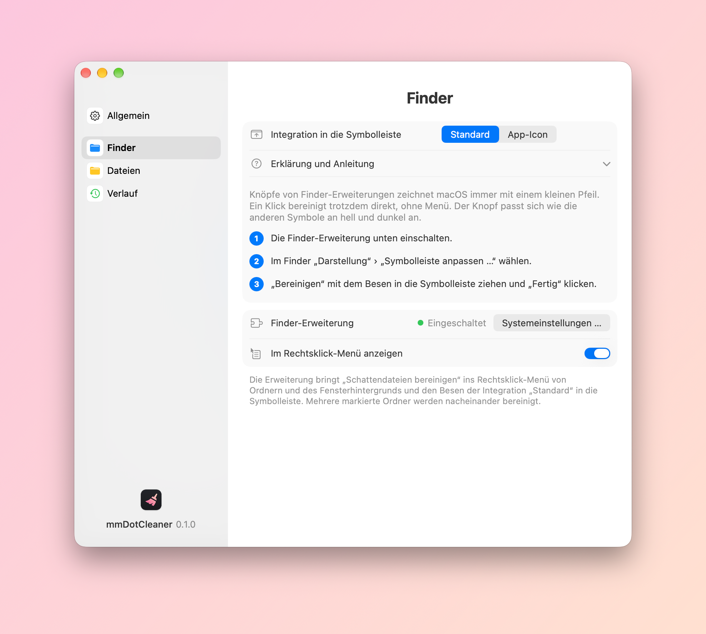
  </picture>

  <picture>
    <source media="(prefers-color-scheme: dark)" srcset="images/de/settings-files-dark.png">
    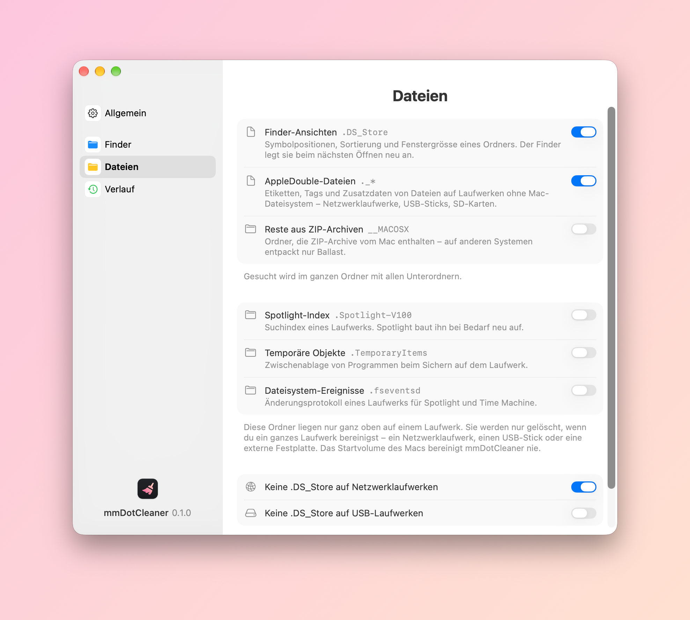
  </picture>
  <picture>
    <source media="(prefers-color-scheme: dark)" srcset="images/de/settings-history-dark.png">
    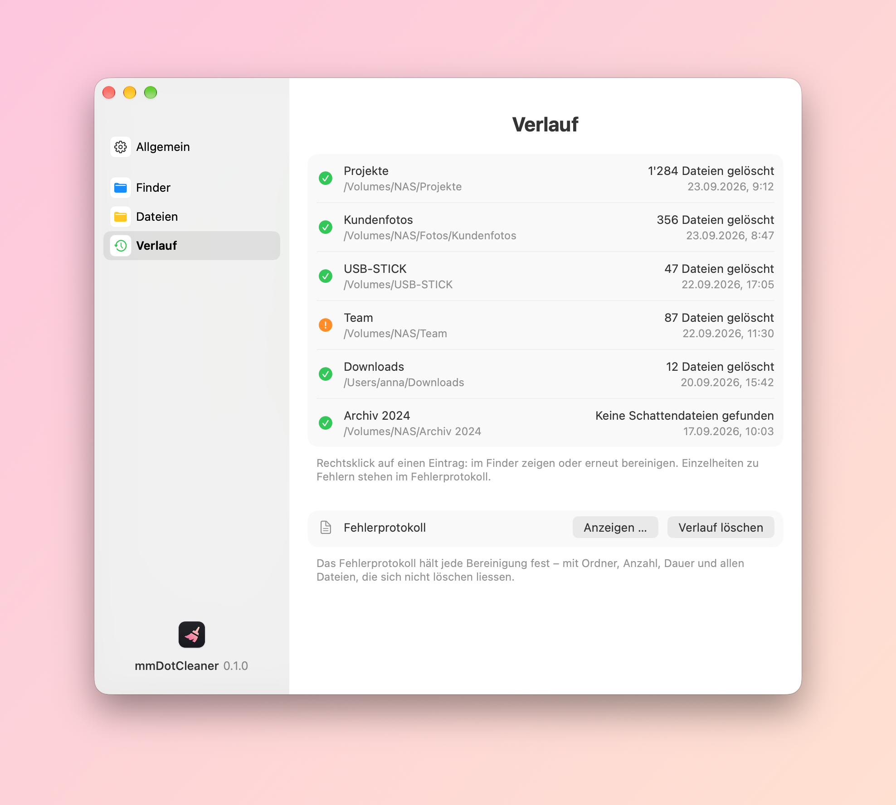
  </picture>

  <picture>
    <source media="(prefers-color-scheme: dark)" srcset="images/de/about-dark.png">
    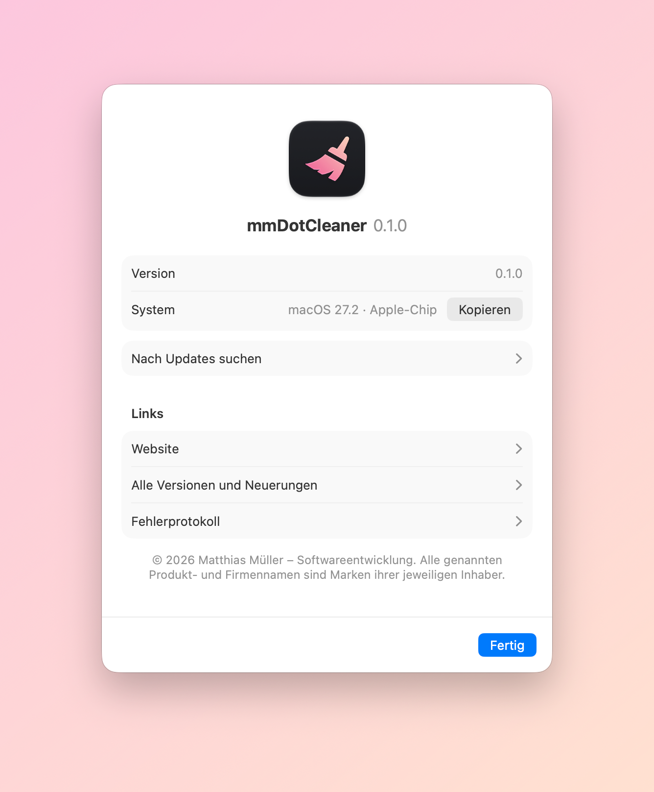
  </picture>

## Download und Installation

1. Unter [Releases](../../releases/latest) die Datei `mmDotCleaner-<Version>.dmg` herunterladen.
2. DMG öffnen und mmDotCleaner in den Ordner „Programme“ ziehen.
3. Beim ersten Start fragt macOS nach einer Freigabe: Systemeinstellungen › Datenschutz & Sicherheit › „Trotzdem öffnen“.

Danach aktualisiert sich mmDotCleaner selbst: Die App sucht täglich nach neuen Versionen und installiert sie nach Bestätigung (Einstellungen › Allgemein › „Jetzt suchen …“).

## Der Besen in der Symbolleiste

Die Seite „Finder“ in den Einstellungen erklärt beide Wege Schritt für Schritt:

- **Standard:** mmDotCleaner bringt eine Finder-Erweiterung mit. Einmal in den Systemeinstellungen einschalten, dann über „Darstellung › Symbolleiste anpassen …“ den Besen in die Symbolleiste ziehen. Der Knopf passt sich wie die übrigen Finder-Symbole an hell und dunkel an; macOS zeichnet Knöpfe von Erweiterungen allerdings immer mit einem kleinen Pfeil. Die Erweiterung bringt auch den Befehl ins Rechtsklick-Menü.
- **App-Icon:** Wer den Pfeil nicht mag, zieht stattdessen das kleine Programm „Bereinigen“ mit gedrückter ⌘-Taste in die Symbolleiste – ohne Pfeil, mit dem App-Icon. Beim ersten Klick fragt macOS einmal, ob mmDotCleaner den Finder steuern darf; nur so erfährt es, welcher Ordner offen ist.

## Voraussetzungen

- macOS 14 (Sonoma) oder neuer, Mac mit Apple-Chip oder Intel

---

## English

<picture>
  <source media="(prefers-color-scheme: dark)" srcset="images/en/hero-dark.png">
  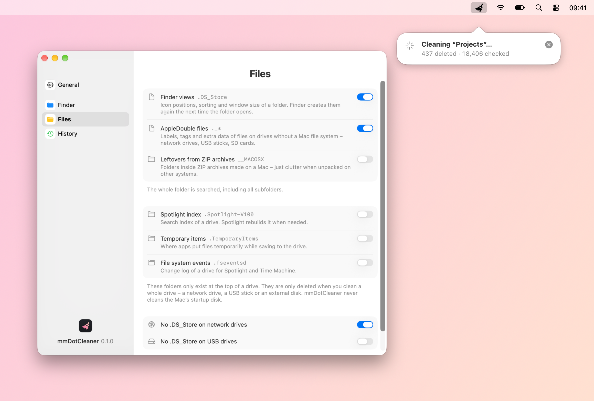
</picture>

mmDotCleaner sweeps `.DS_Store` and `._` files out of any folder – with one click in Finder’s toolbar.

- **One click in Finder:** the broom in the toolbar cleans the folder open in the window – including all subfolders, even whole network drives, USB sticks and external disks. No confirmation, no menu.
- **macOS shadow files:** `.DS_Store` (Finder views) and `._*` (AppleDouble files) – plus, if you like, `__MACOSX` from ZIP archives and `.Spotlight-V100`, `.TemporaryItems` and `.fseventsd` at the top of a drive. You choose which kinds are deleted. Everything else stays untouched, as do a drive’s trash and the Mac’s startup disk.
- **Progress in the menu bar:** a bubble below the icon shows what is being cleaned and then the result. It closes by itself after a few seconds.
- **Context menu:** “Clean Up Shadow Files” for selected folders or the window background; several folders are cleaned one after the other.
- **Prevention:** if you like, Finder stops creating new `.DS_Store` files on network and USB drives.
- **History and error log:** every cleanup with folder, count per file kind and duration; files that couldn’t be deleted are listed in the error log.
- **Menu bar app:** choose or hide the icon, launch at login, appearance Automatic/Light/Dark, automatic updates once you confirm, **English, German, French, Italian and Spanish**, Liquid Glass on macOS 26 and later.

  <picture>
    <source media="(prefers-color-scheme: dark)" srcset="images/en/progress-dark.png">
    
  </picture>
  <picture>
    <source media="(prefers-color-scheme: dark)" srcset="images/en/result-dark.png">
    
  </picture>

<picture>
  <source media="(prefers-color-scheme: dark)" srcset="images/en/menubar-dark.png">
  
</picture>

  <picture>
    <source media="(prefers-color-scheme: dark)" srcset="images/en/settings-general-dark.png">
    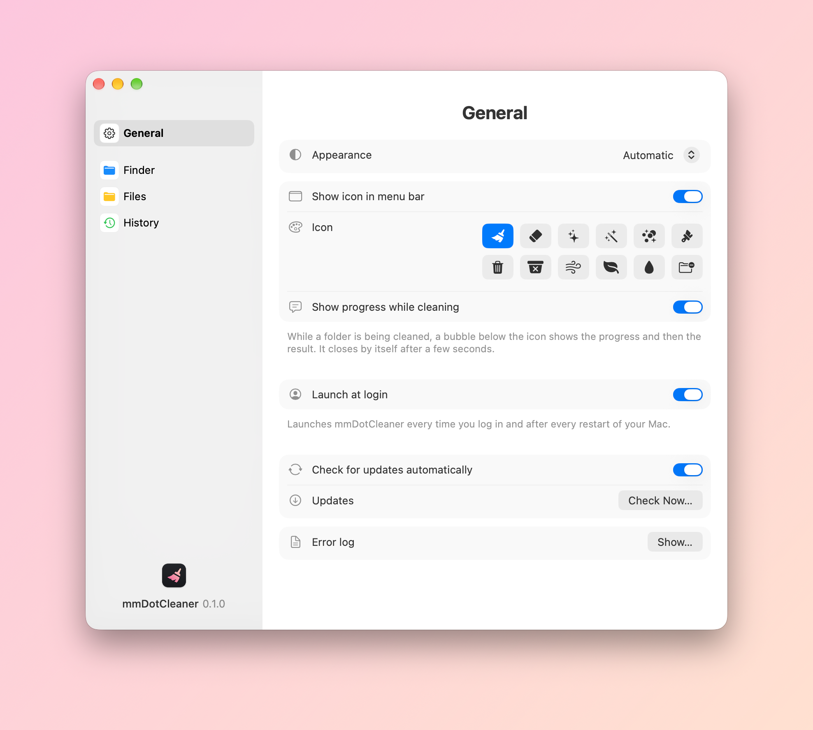
  </picture>
  <picture>
    <source media="(prefers-color-scheme: dark)" srcset="images/en/settings-finder-dark.png">
    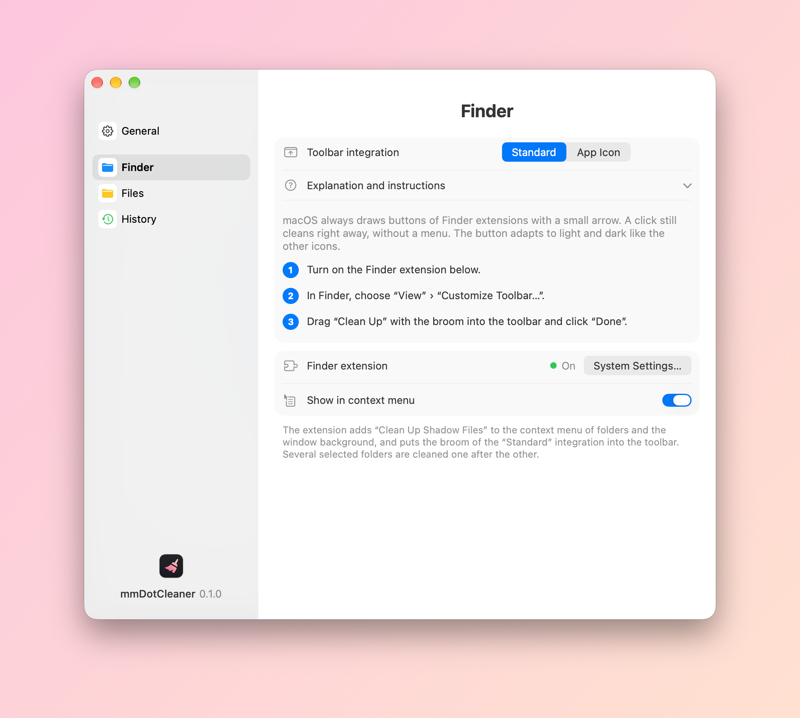
  </picture>

  <picture>
    <source media="(prefers-color-scheme: dark)" srcset="images/en/settings-files-dark.png">
    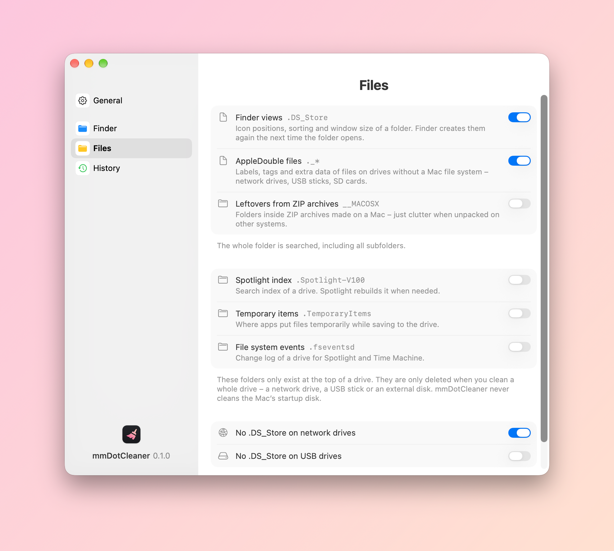
  </picture>
  <picture>
    <source media="(prefers-color-scheme: dark)" srcset="images/en/settings-history-dark.png">
    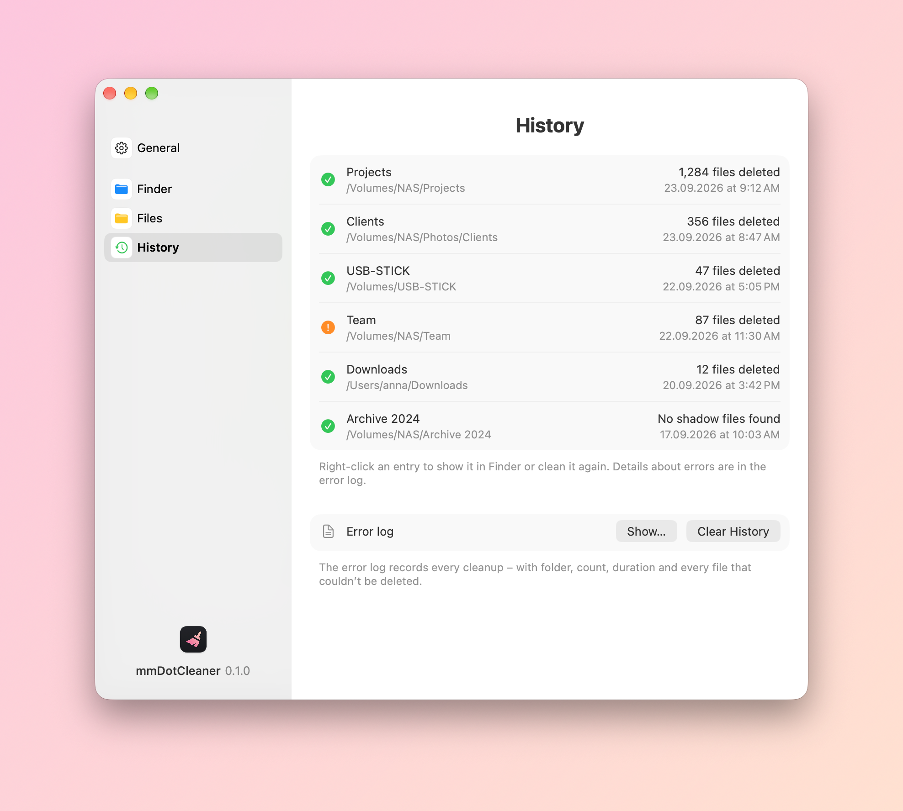
  </picture>

  <picture>
    <source media="(prefers-color-scheme: dark)" srcset="images/en/about-dark.png">
    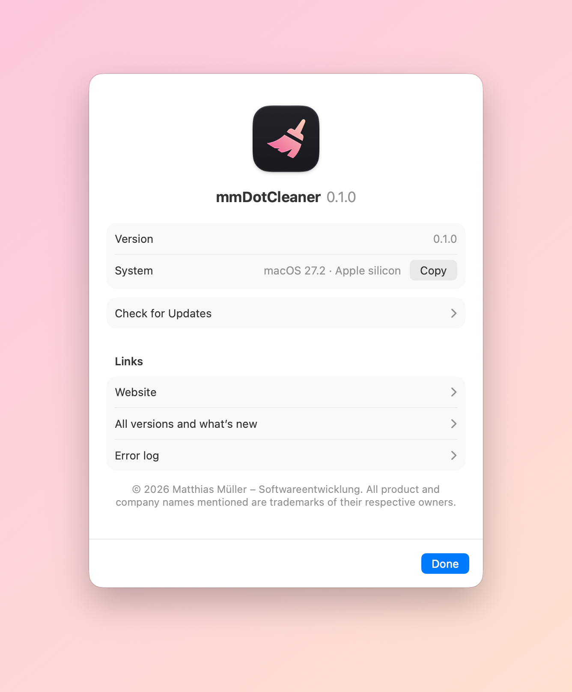
  </picture>

### Download and installation

1. Download `mmDotCleaner-<version>.dmg` from [Releases](../../releases/latest).
2. Open the disk image and drag mmDotCleaner to the Applications folder.
3. On first launch macOS asks for your approval: System Settings › Privacy & Security › “Open Anyway”.

After that mmDotCleaner updates itself: it checks for new versions daily and installs them once you confirm (Settings › General › “Check Now…”).

### The broom in the toolbar

The “Finder” page of the settings explains both ways step by step:

- **Standard:** mmDotCleaner comes with a Finder extension. Switch it on once in System Settings, then drag the broom into the toolbar via “View › Customize Toolbar…”. The button adapts to light and dark like Finder’s other icons; macOS always draws buttons of extensions with a small arrow, though. The extension also adds the command to the context menu.
- **App Icon:** if you don’t like the arrow, hold ⌘ and drag the small “Clean Up” app into the toolbar instead – no arrow, with the app icon. On the first click macOS asks once whether mmDotCleaner may control Finder; that’s how it learns which folder is open.

### Requirements

- macOS 14 (Sonoma) or later, Mac with Apple silicon or Intel

---

© 2026 Matthias Müller – Softwareentwicklung · [www.mm-softwareentwicklung.de](https://www.mm-softwareentwicklung.de)

Alle genannten Produkt- und Firmennamen sind Marken ihrer jeweiligen Inhaber. 
All product and company names mentioned are trademarks of their respective owners.
